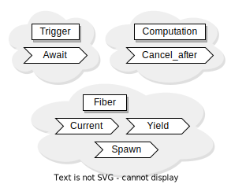

[API reference](https://ocaml-multicore.github.io/picos/doc/picos/index.html)
&middot; [Benchmarks](https://bench.ci.dev/ocaml-multicore/picos/branch/main)
&middot;
[Stdlib Benchmarks](https://bench.ci.dev/ocaml-multicore/multicore-bench/branch/main)

# **Picos** &mdash; Interoperable effects based concurrency

Picos, or [pico](https://en.wikipedia.org/wiki/Metric_prefix)-scheduler
framework, is a framework for building
[interoperable](https://en.wikipedia.org/wiki/Interoperability) elements of
effects based cooperative concurrent programming models.

### Why?

There are already several concrete effects-based concurrent programming
libraries and models being developed. Here is a list of some such publicly
available projects:[\*](https://xkcd.com/927/)

1. [Affect](https://github.com/dbuenzli/affect) — "Composable concurrency
   primitives with OCaml effects handlers (unreleased)",
2. [Domainslib](https://github.com/ocaml-multicore/domainslib) —
   "Nested-parallel programming",
3. [Eio](https://github.com/ocaml-multicore/eio) — "Effects-Based Parallel IO
   for OCaml",
4. [Fuseau](https://github.com/c-cube/fuseau) — "Lightweight fiber library for
   OCaml 5",
5. [Miou](https://github.com/robur-coop/miou) — "A simple scheduler for OCaml
   5",
6. [Moonpool](https://github.com/c-cube/moonpool) — "Commodity thread pools for
   OCaml 5", and
7. [Riot](https://github.com/leostera/riot) — "An actor-model multi-core
   scheduler for OCaml 5".

All of the above libraries are mutually incompatible with each other with the
exception that Domainslib, Eio, and Moonpool implement an earlier
interoperability proposal called
[domain-local-await](https://github.com/ocaml-multicore/domain-local-await/) or
DLA, which allows a concurrent programming library like
[Kcas](https://github.com/ocaml-multicore/kcas/)[\*](https://github.com/ocaml-multicore/kcas/pull/136)
to work on all of those. Unfortunately, DLA, by itself, is known to be
insufficient and the design has not been universally accepted.

By introducing an interoperability framework and key libraries, such as an IO
library, for such a framework, we hope that the scarce resources of the OCaml
community are not further divided into mutually incompatible ecosystems built on
top of such mutually incompatible concurrent programming libraries, while,
simultaneously, making it possible to experiment with many kinds of concurrent
programming models.

It should be
technically[\*](https://www.youtube.com/watch?v=hou0lU8WMgo) possible
to

1. make all of the previously mentioned libraries
   [Picos compatible](https://ocaml-multicore.github.io/picos/doc/picos/Picos/index.html#picos-compatible),
   i.e. to handle the Picos effects, and
2. have their elements
   [implemented in Picos](https://ocaml-multicore.github.io/picos/doc/picos/Picos/index.html#implemented-in-picos),
   i.e. to make them usable on other Picos-compatible schedulers.

Please read
[the introduction section of the reference manual](https://ocaml-multicore.github.io/picos/doc/picos/Picos/index.html)
for further information.
